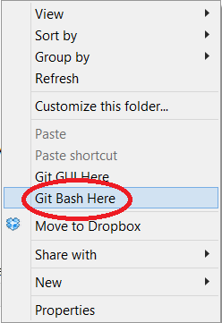

# **Practicando Git**

# **Objetivos**

1. Aprender comandos básicos del terminal (ej: pwd, ls, cd, mkdir, touch)
2. Utilizar comandos básico de git

# **Actividad**

1. Familiarízate con los comandos básicos de la terminal, incluyendo: pwd, ls, ls -l, cd, mkdir y touch.
2. Crea un repositorio git local en la carpeta de la actividad anterior y lleva esto a tu GitHub.
3. Encuentra algún repositorio interesante en GitHub que te interese, para clonarlo en tu computador.
    1. Si no puedes encontrar algo interesante, puedes clonar **[https://github.com/choi5983/street_fighter.git](https://github.com/choi5983/street_fighter.git)** o **[https://github.com/choi5983/bomberman.git](https://github.com/choi5983/bomberman.git)**. Estos fueron juegos de demostración construidos durante la clase.
4. Más tarde este fin de semana, cuando tengas tiempo, visita el curso completo de Terminal y Git **[aquí](http://login.codingdojo.com/m/2/5594/36800)**

# **Vídeo de Información General**

# **Notas adicionales respecto al vídeo**

1. Si nunca has utilizado git, cuando llevas códigos a GitHub, se te preguntará por tus credenciales. Una vez que las agregas, se enviarán tus códigos a GitHub. Basta con hacer esto una vez ya tus credenciales serán recordadas y utilizadas automáticamente cuando quieras llevar código a GitHub.
2. Una vez que hayas actualizado los archivos en tu repositorio git actual, necesitarás ejecutar cada vez “git add” y “git commit -m____” . Cada vez que hayas actualizado tu repositorio localmente, puedes enviar tus códigos a GitHub (ej: git push origin master).
3. Para el curso detallado de Terminal y Git, visita: **[http://login.codingdojo.com/m/2/5594/36677](http://login.codingdojo.com/m/2/5594/36677)**

# **Comandos Básicos de Terminal para Mac/Linux**

Para comenzar, abre tu terminal y prueba los comandos a continuación. Ten en cuenta que la mayoría de estos funcionan bien en Windows command prompt (cmd), y las diferencias existentes se notan.

**Present working directory**

```bash
pwd
copy
```

Usa este comando cada vez que no estés seguro donde estás actualmente en tu estructura de archivos. *pwd* significa Present Working Directory o Directorio de Trabajo Actual. En Windows puedes usar *pwd* o *cd*.

**List files (lista de archivos)**

```bash
ls
copy
```

Utiliza el comando *ls* para ver todos los directorios y archivos que están en tu directorio actual. Para ser más claros, un directorio es simplemente un sinónimo de carpeta. En *‘cmd’* utiliza el comando *dir*.

**List files (long form) / Lista de archivos (forma extensa)**

```bash
ls -l
copy
```

Utiliza este comando para ver una forma extensa de los directorios y archivos dentro de tu directorio actual.

Verás algunos mensajes incomprensibles a un lado. El *‘dwx’* es simplemente un permiso de archivo para ese directorio o archivo en particular. Por ejemplo. el primer set de *‘-’s* que sigue a *‘d’* son los permisos autorizados para el usuario. Si dice *‘rwx’* significa que el usuario está autorizado para leer, escribir y ejecutar el archivo. Si solo dice *‘r--’* significa que el usuario solo puede leer el archivo. El segundo set de tres *‘-’s* representa el permiso para un grupo. Los últimos tres *‘-’s* representan el permiso para personas que no son usuarios y no pertenecen al grupo autorizado. Tendremos que cambiar algunos de estos permisos cuando implementamos nuestras aplicaciones en la nube. Por ahora, es importante saber que hay diferentes permisos de archivo respecto a leer, escribir o ejecutar, y estos permisos pueden variar dependiendo si eres el usuario o del grupo especificado en la lista.

**Cambiando al directorio principal**

```bash
cd ..
copy
```

Tal como el comando *‘cd .’*, *‘..’* representa al directorio principal de la carpeta en la que estamos. Si ejecutas este comando y luego ejecutas el comando *‘pwd’*. verás que navegamos a una estructura de directorio (carpeta). Si sientes que la Estructura de Archivo empieza a asemejarse al DOM (Document Object Model), es porque, de hecho, son muy similares.

**Cambiando a cualquier carpeta**

```bash
cd nombre_carpeta
copy
```

El comando *‘cd’* seguido de un espacio y el nombre de la carpeta que quieres acceder te llevará a ese directorio, si es que existe. El ejemplo anterior te llevaría al directorio ‘nombre_carpeta’.

**Creando una nueva carpeta**

```bash
mkdir nombre_nuevo_directorio
copy
```

Este comando creará un nuevo directorio llamado ‘nombre_nuevo_directorio’. Cualquiera texto que escribas en este comando será el nombre de tu nuevo archivo. Luego de crear el directorio, puedes ejecutar ‘cd nombre_nuevo_directorio’ para entrar a ese directorio.

**Creando un nuevo archivo**

```bash
touch index.html
touch style.css
copy
```

El comando ‘touch’ creará un archivo vacío con el nombre y extensión que especifiques. Puedes crear todo tipo de archivos si agregas el tipo de extensión. Ejecuta los comandos del ejemplo y luego ejecuta ‘ls’ y así verás tus nuevos archivos en la lista.

# **Comandos Básicos de Git**

- git init - Inicia un repositorio git local en la carpeta
- git add . - Agrega todos los archivos nuevos en preparación (staging)
- git status
- git commit -m "__message__" - realiza los cambios
- git remote add origin __github_url___ - agrega un lugar remoto llamado ‘origin’ que apunta a tu github_url
- git push - lleva tus últimos cambios a github
- git clone __github_url__ - clona un repositorio de github a tu directorio de trabajo local

# **Instalando Git Bash para Windows**

**(Si eres usuario de Mac, puedes saltarte estos pasos)**

Los usuarios de Windows no solo tienen una, sino que 2 terminales nativos: Command Prompt (AKA CDM) y PowerShell, y ninguno tiene el mismo set de comandos que el terminal bash Mac/Linux. Para evitar confusiones y porque será importante saber cómo usar un terminal bash más adelante en el bootcamp, te recomendamos descargar un emulador bash, así puedes usar los mismos comandos que tus compañeros con Mac o Linux. De todas formas es importante que sepas CMD PowerShell o ambos.

### **Git Bash**

Sigue **[este link](http://git-scm.com/downloads)** para instalar Git. Cuando lo instales, asegúrate de marcar la casilla Git Bash Here. Esto no solo instalará tu terminal Git Bash, sino que también lo integrará con Windows Explorer.


Si ves el Git Bash here en tu opciones del botón derecho, quiere decir que lo instalaste bien.



Abre  el terminal Bash y confirma que ves lo siguiente:


¡Genial! ¡Funciona! Ahora puedes ejecutar comandos Unix-style.